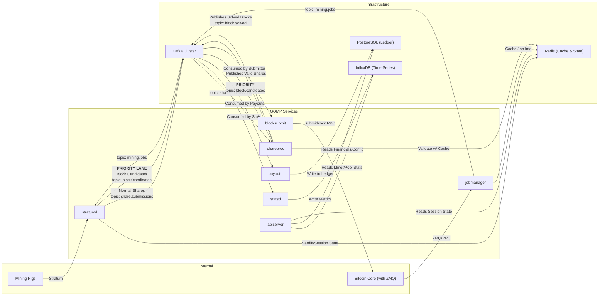

# GOMP (Go Mining Pool): Technical Design & Architecture

**Target Go Version**: 1.24+

**Status**: Proposed

## 1\. Guiding Philosophy & Introduction

This document specifies the technical architecture for GOMP, a new, from-scratch Bitcoin mining pool built in Go. This is not a re-architecture of an existing system, but a greenfield project designed to embody the core philosophies of the Go language: simplicity, concurrency, and performance.

The non-negotiable, primary directive for this project is performance. Every architectural decision, library choice, and implementation pattern must be justifiable from a performance-first perspective. The goal is to build a system that is not only massively scalable but also ruthlessly efficient in terms of latency, CPU usage, and memory allocation.

We will achieve this by building a set of small, specialized, and independently scalable microservices that communicate asynchronously over an Apache Kafka message bus.

## 2\. Core Architectural Principles

  - **Concurrency over Parallelism**: We will leverage Go's lightweight goroutines and channels to handle tens of thousands of concurrent I/O operations (like miner connections) efficiently without relying on complex callback-based systems.
  - **Simplicity & Clarity**: The codebase will be aggressively idiomatic. We will favor the standard library wherever possible and avoid unnecessary abstractions. "A little copying is better than a little dependency."
  - **Performance is Paramount**: Every microsecond matters. We will optimize hot paths, minimize heap allocations, and use tools like `pprof` to identify and eliminate bottlenecks.
  - **Explicit Error Handling**: All errors will be handled explicitly and returned as values. We will not use panics for recoverable errors.
  - **Polyglot Persistence**: We will use the best data store for each job: PostgreSQL for transactional integrity, InfluxDB for high-throughput time-series data, and Redis for high-speed caching and state.
  - **Efficient Messaging**: Inter-service communication over Kafka will use Protocol Buffers (Protobufs) for high-speed, compact, and strongly-typed message serialization.

## 3\. High-Level Architecture

The system is composed of several focused microservices communicating via Kafka. This design allows for independent scaling and fault tolerance.

### 3.1. Architectural Diagram with Priority Lane

This diagram illustrates the optimized data flow, featuring a dedicated "Priority Lane" to expedite solved blocks and minimize the risk of stale blocks.



### 3.2. Go Microservice Breakdown

| Service | Binary Name (`/cmd`) | Responsibilities | Recommended Go Modules | Key Performance Considerations |
|---|---|---|---|---|
| Stratum Gateway | `stratumd` | Manages TCP connections. Translates Stratum JSON-RPC to Protobuf. **Routes high-difficulty shares to the priority lane.** | `net`, `log/slog`, `segmentio/kafka-go`, `redis/go-redis/v9`, `google.golang.org/protobuf` | Minimal allocations per connection. `sync.Pool` for buffers. Efficient I/O loop. |
| Job Manager | `jobmanager` | Interfaces with Bitcoin Core. Creates mining jobs, publishes them to Kafka, and caches validation data in Redis. | `github.com/btcsuite/btcd/rpcclient`, `github.com/pebbe/zmq4`, `segmentio/kafka-go`, `redis/go-redis/v9`, `google.golang.org/protobuf` | Low-latency response to ZMQ notifications. Ensure non-blocking operations. |
| Share Processor | `shareproc` | Core validation engine. Consumes from both share topics with priority on block candidates. Validates statefully, reconstructs blocks. | `github.com/lovoo/goka`, `github.com/btcsuite/btcd/btcutil`, `google.golang.org/protobuf` | In-memory state via Goka is crucial to avoid DB lookups. Logic must be heavily optimized. |
| Block Submitter | `blocksubmit` | Minimal service. Consumes solved blocks from the hot path topic and immediately submits them to Bitcoin Core via RPC. | `github.com/btcsuite/btcd/rpcclient`, `segmentio/kafka-go`, `google.golang.org/protobuf` | Zero unnecessary logic. Optimized for the lowest possible submission latency. |
| Statistics Service | `statsd` | Data pipeline service. Consumes valid/invalid share topics and writes aggregated metrics into InfluxDB. | `segmentio/kafka-go`, `github.com/InfluxCommunity/influxdb3-go`, `google.golang.org/protobuf` | Batch writes to InfluxDB. Asynchronous processing to keep up with Kafka. |
| Payout Service | `payoutd` | Handles the financial ledger. Consumes valid shares to calculate rewards. Manages balances against PostgreSQL. | `segmentio/kafka-go`, `github.com/jackc/pgx/v5`, `google.golang.org/protobuf` | Use of explicit database transactions for all financial operations. Idempotent design. |
| API Service | `apiserver` | Provides the public REST API (JSON). Queries data stores to serve miner and pool data. | `github.com/go-chi/chi/v5`, `github.com/jackc/pgx/v5`, `github.com/InfluxCommunity/influxdb3-go`, `redis/go-redis/v9` | Heavy caching. Efficient JSON serialization. Translates internal data to external JSON. |

## 4\. Data Flow & Sequence Diagrams

### 4.1. The Critical Distinction: **Hot Path** vs. **Warm Path**

To achieve maximum performance, the architecture explicitly separates two data flows:

  - **Hot Path** (Latency Critical): The journey of a block-winning share from miner to network submission. This path is optimized for absolute minimum latency.
  - **Warm Path** (Throughput Critical): The journey of the millions of normal shares used for accounting and statistics. This path is optimized for high throughput, and a few seconds of lag is acceptable.

The new **Priority Lane** is a crucial enhancement to the Hot Path.

### 4.2. Kafka Topic Design

The topic design reflects the separation of the data paths. All messages are Protobuf-encoded.

  - `mining.jobs`: Broadcasts new work templates to gateways.
  - `share.submissions`: (**Warm Path**) The raw, high-volume firehose of standard-difficulty shares.
  - `share.valid`: (**Warm Path**) Cryptographically valid shares for active jobs.
  - `share.rejected`: (**Warm Path**) Cryptographically invalid shares.
  - `share.stale`: (**Warm Path**) Cryptographically valid shares for expired jobs.
  - `block.candidates`: (**Hot Path Priority Lane**) A low-volume topic containing only shares that meet the block difficulty target, enabling them to bypass the main queue.
  - `block.solved`: (**Hot Path**) Critical, low-volume topic. Contains a full, solved block hex ready for immediate submission.

## 5\. Data Storage Architecture

A polyglot persistence strategy will be employed, using the best tool for each specific data-handling job.

### 5.1. PostgreSQL 17: The Transactional Ledger

**Role**: Single Source of Truth for all financial and configuration data that requires strong transactional consistency (ACID compliance).

**Data Stored**: Balances, Payouts, Blocks, and Client Configuration.

**Justification**: The integrity of the pool's finances is paramount. PostgreSQL's robustness and support for complex, atomic transactions make it the only appropriate choice for this role.

### 5.2. InfluxDB 3: The Time-Series Engine

**Role**: The high-throughput engine for all time-stamped event data, optimized for massive write volumes and fast analytical range queries.

**Data Stored**: `shares` measurement with tags like `miner_address`, `worker_name`, and `status`.

**Justification**: This offloads the immense write pressure of share submissions from PostgreSQL. It enables the `apiserver` to serve complex statistical queries (e.g., hashrate charts) without impacting the performance of the financial database.

### 5.3. Redis 8: The High-Speed Operational Cache

**Role**: The low-latency, shared "short-term memory" for the entire system, enabling fast lookups and state management across distributed services.

**Data Stored**: Job Validation Cache, Vardiff & Session State, Distributed Rate Limiting, and API Response Caches.

## 6\. Implementation Details & Go Best Practices

**Concurrency**: Each microservice should be built around a structured concurrency model using `context` for cancellation and `sync.WaitGroup` or `errgroup` for managing goroutine lifecycles.

**Performance**:

  - **Memory Allocations**: The Hot Path (`stratumd` -\> `shareproc`) must be aggressively optimized to minimize heap allocations. We will use `sync.Pool` to reuse objects like byte buffers and Protobuf message structs.
  - **Profiling**: We will use the standard library `pprof` tool extensively to profile CPU and memory usage and identify bottlenecks early and often. `go test -bench` will be used to benchmark critical functions.

**Logging**: All services will use the standard library's `log/slog` package for structured, high-performance logging.

**Configuration**: Services will be configured via environment variables and command-line flags, following the 12-Factor App methodology.

## 7\. Advanced Performance Optimizations for `stratumd`

Given that `stratumd` is the most I/O-bound component, the following advanced strategies will be considered:

  - **TCP Socket Tuning**: The listener will be configured to set `TCP_NODELAY` on all accepted connections.
  - **Event-Driven Networking Libraries (Optional)**: If profiling reveals a bottleneck in the standard `net` package, we will consider a specialized library like `gnet`. This is a trade-off between simplicity and raw performance at extreme scale.

## 8\. Proposed Go Repository Structure

We will adopt the "Standard Go Project Layout." This provides a well-understood structure for separating concerns.

```
/gomp/
├── /cmd/
│   ├── /apiserver/
│   ├── /blocksubmit/
│   ├── /jobmanager/
│   ├── /payoutd/
│   ├── /shareproc/
│   ├── /statsd/
│   └── /stratumd/
├── /internal/
│   ├── api/
│   ├── bitcoin/
│   ├── config/
│   ├── database/
│   ├── stratum/
│   └── validation/
├── /pkg/
│   └── /log/
├── /proto/
│   └── /gomp/v1/
│       ├── share.proto
│       └── job.proto
├── /api/
├── /configs/
├── /deployments/
│
├── go.mod
├── go.sum
└── README.md
```
