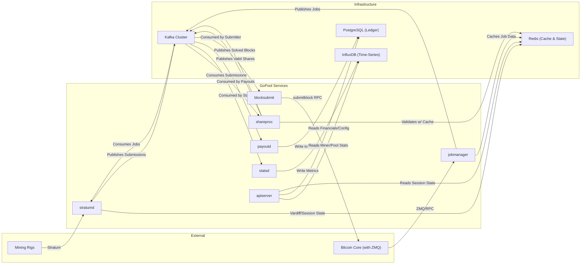

# GoPool: Technical Design & Architecture

**Target Go Version**: 1.24

**Status**: Proposed

## 1. Guiding Philosophy & Introduction

This document specifies the technical architecture for GoPool, a new, from-scratch Bitcoin mining pool built in Go. This is not a re-architecture of an existing system, but a greenfield project designed to embody the core philosophies of the Go language: simplicity, concurrency, and performance.

The non-negotiable, primary directive for this project is performance. Every architectural decision, library choice, and implementation pattern must be justifiable from a performance-first perspective. The goal is to build a system that is not only massively scalable but also ruthlessly efficient in terms of latency, CPU usage, and memory allocation.

We will achieve this by building a set of small, specialized, and independently scalable microservices that communicate asynchronously over an Apache Kafka384 message bus.

## 2. Core Architectural Principles

- **Concurrency over Parallelism**: We will leverage Go's lightweight goroutines and channels to handle tens of thousands of concurrent I/O operations (like miner connections) efficiently without relying on complex callback-based systems.
- **Simplicity & Clarity**: The codebase will be aggressively idiomatic. We will favor the standard library wherever possible and avoid unnecessary abstractions. "A little copying is better than a little dependency."
- **Performance is Paramount**: Every microsecond matters. We will optimize hot paths, minimize heap allocations, and use tools like `pprof` to identify and eliminate bottlenecks.
- **Explicit Error Handling**: All errors will be handled explicitly and returned as values. We will not use panics for recoverable errors.
- **Polyglot Persistence**: We will use the best data store for each job: PostgreSQL for transactional integrity, InfluxDB for high-throughput time-series data, and Redis for high-speed caching and state.
- **Efficient Messaging**: Inter-service communication over Kafka will use Protocol Buffers (Protobufs) for high-speed, compact, and strongly-typed message serialization.

## 3. High-Level Architecture

The system is composed of several focused microservices communicating via Kafka. This design allows for independent scaling and fault tolerance.

### 3.1. Architectural Diagram



### 3.2. Go Microservice Breakdown

| Service          | Binary Name (`/cmd`) | Responsibilities                                                                 | Recommended Go Modules                                                                 | Key Performance Considerations                                                                 |
|------------------|----------------------|---------------------------------------------------------------------------------|---------------------------------------------------------------------------------------|-----------------------------------------------------------------------------------------------|
| Stratum Gateway  | `stratumd`           | Manages thousands of concurrent TCP connections. Translates inbound Stratum JSON-RPC to internal Protobuf messages for Kafka. Implements Vardiff logic. | `net`, `log/slog`, `segmentio/kafka-go`, `redis/go-redis`, `google.golang.org/protobuf` | Minimal allocations per connection. `sync.Pool` for buffers. Efficient I/O loop with goroutines. |
| Job Manager      | `jobmanager`         | Interfaces with Bitcoin Core. Creates mining jobs, publishes them to Kafka as Protobufs, and caches validation data in Redis. | `github.com/btcsuite/btcd/rpcclient`, `github.com/pebbe/zmq4`, `segmentio/kafka-go`, `redis/go-redis`, `google.golang.org/protobuf` | Low-latency response to ZMQ notifications is critical. Ensure non-blocking operations.         |
| Share Processor  | `shareproc`          | The core validation engine. Consumes raw Protobuf shares, validates them statefully, and publishes results. Reconstructs and publishes solved blocks. | `goka`, `github.com/btcsuite/btcd/btcutil`, `google.golang.org/protobuf`               | In-memory state management for job IDs is crucial to avoid DB lookups. Logic must be heavily optimized. |
| Block Submitter  | `blocksubmit`        | A minimal service. Consumes solved block Protobuf messages and immediately submits the block to Bitcoin Core via RPC. | `github.com/btcsuite/btcd/rpcclient`, `segmentio/kafka-go`, `google.golang.org/protobuf` | Zero unnecessary logic. This service's entire lifecycle is optimized for the lowest possible submission latency. |
| Statistics Service | `statsd`           | A data pipeline service. Consumes share result topics and writes aggregated metrics and raw share data into InfluxDB. | `segmentio/kafka-go`, `github.com/InfluxCommunity/influxdb3-go`, `google.golang.org/protobuf` | Batch writes to InfluxDB. Asynchronous processing to keep up with Kafka consumer group lag.    |
| Payout Service   | `payoutd`           | Handles the financial ledger. Consumes valid shares to calculate rewards. Manages balances and processes payouts against PostgreSQL. | `segmentio/kafka-go`, `github.com/jackc/pgx/v5`, `google.golang.org/protobuf`          | Use of explicit database transactions for all financial operations. Idempotent design.         |
| API Service      | `apiserver`         | Provides the REST API (JSON). Queries the various data stores to serve miner and pool data. | `chi`, `github.com/jackc/pgx/v5`, `github.com/InfluxCommunity/influxdb3-go`, `redis/go-redis`             | Heavy caching. Efficient JSON serialization. This is the main service that translates internal data to external JSON. |

## 4. Data Flow & Sequence Diagrams

### 4.1. The Critical Distinction: **Hot Path** vs. **Warm Path**

To achieve maximum performance, the architecture explicitly separates two data flows:

- **Hot Path** (Latency Critical): The journey of a block-winning share from validation to network submission. This path is optimized for absolute minimum latency.
- **Warm Path** (Throughput Critical): The journey of the millions of normal shares used for accounting and statistics. This path is optimized for high throughput, and a few seconds of lag is acceptable.

### 4.2. Kafka Topic Design

The topic design reflects the separation of **Hot Path** and **Warm Path**. All messages are Protobuf-encoded.

- `mining.jobs`: Broadcasts new work templates to gateways.
- `share.submissions`: The raw, high-volume firehose of all shares.
- `share.valid`: (**Warm Path**) Cryptographically valid shares for active jobs.
- `share.rejected`: (**Warm Path**) Cryptographically invalid shares.
- `share.stale`: (**Warm Path**) Cryptographically valid shares for expired jobs.
- `block.found`: (**Warm Path**) A notification that a block has been found by the pool.
- `block.solved`: (**Hot Path**) Critical, low-volume topic. Contains a full, solved block hex ready for immediate submission.

## 5. Data Storage Architecture

A polyglot persistence strategy will be employed, using the best tool for each specific data-handling job.

### 5.1. PostgreSQL 17: The Transactional Ledger

**Role**: Single Source of Truth for all financial and configuration data that requires strong transactional consistency (ACID compliance).

**Data Stored**:

- **Balances**: The authoritative ledger of how much each miner is owed.
- **Payouts**: A historical record of all on-chain Bitcoin transactions sent to miners.
- **Blocks**: The canonical list of blocks successfully mined by the pool and their reward status.
- **Clients**: Configuration data for miners and workers, such as payout thresholds or notification settings.

**Justification**: The integrity of the pool's finances is paramount. PostgreSQL's robustness and support for complex, atomic transactions make it the only appropriate choice for this role.

### 5.2. InfluxDB 3: The Time-Series Engine

**Role**: The high-throughput engine for all time-stamped event data, optimized for massive write volumes and fast analytical range queries.

**Data Stored**:

- **Measurement**: `shares`
- **Tags (indexed)**: `miner_address`, `worker_name`, `status` (`valid`, `rejected`, `stale`), `job_id`.
- **Fields**: `difficulty` (float), `latency_ms` (integer).

**Justification**: This offloads the immense write pressure of share submissions from PostgreSQL. It enables the `apiserver` to serve complex statistical queries (e.g., hashrate charts) without impacting the performance of the financial database. Built-in data lifecycle management is critical for managing storage costs.

### 5.3. Redis 8: The High-Speed Operational Cache

**Role**: The low-latency, shared "short-term memory" for the entire system, enabling fast lookups and state management across distributed services.

**Data Stored**:

- **Job Validation Cache**: Stores active job data (`job:<jobId>`) with a short TTL. This is the critical mechanism that allows the `shareproc` to quickly identify stale shares without a database query.
- **Vardiff & Session State**: Caches a miner's last known difficulty and recent performance metrics. This provides a smooth experience on reconnection, even to a different `stratumd` instance.
- **Distributed Rate Limiting**: Provides atomic counters for enforcing rate limits across all horizontally scaled API and Stratum gateway instances.
- **API Response Cache**: Caches results of frequent, non-critical API endpoints (e.g., pool-wide stats) to reduce load on backend databases.

## 6. Implementation Details & Go Best Practices

**Concurrency**: Each microservice should be built around a structured concurrency model using `context` for cancellation and `sync.WaitGroup` or `errgroup` for managing goroutine lifecycles. Channels should be used for communication within a service, while Kafka is used for communication between services.

**Performance**:

- **Memory Allocations**: The **Hot Path** (`stratumd` -> `shareproc`) must be aggressively optimized to minimize heap allocations. We will use `sync.Pool` to reuse objects like byte buffers and Protobuf message structs.
- **Profiling**: We will use the standard library `pprof` tool extensively to profile CPU and memory usage and identify bottlenecks early and often. `go test -bench` will be used to benchmark critical functions.
- **I/O**: We will use buffered I/O (`bufio`) in `stratumd` for efficient network reads and writes.
- **Logging**: All services will use the standard library's `log/slog` package for structured, high-performance logging. We will use `slog.NewJSONHandler` to produce machine-parsable logs.

**Configuration**: Services will be configured via environment variables and command-line flags, following the 12-Factor App methodology. The `flag` standard library package is sufficient. We will avoid complex config files and libraries unless absolutely necessary.

**Error Handling**: All functions that can fail will return an error value. We will use the `errors` package (or `fmt.Errorf` with `%w`) to wrap errors for context, allowing for easy debugging without complex stack traces.

## 7. Advanced Performance Optimizations for `stratumd`

Given that `stratumd` is the most I/O-bound component, the following advanced strategies will be considered:

- **TCP Socket Tuning**: The listener will be configured to set `TCP_NODELAY` on all accepted connections. This is critical for reducing latency for the small, frequent messages characteristic of the Stratum protocol.
- **Event-Driven Networking Libraries (Optional)**: While the standard library's `net` package is the primary choice, we will benchmark its performance at high connection counts. If profiling reveals a bottleneck, we will consider replacing it with a specialized library like `gnet`, which uses a more direct epoll-based model. This is a trade-off between simplicity and raw performance at extreme scale.

## 8. Proposed Go Repository Structure

We will adopt the "Standard Go Project Layout." This provides a well-understood structure for separating concerns.

```
/gopool/
├── /cmd/                     # Main applications for each microservice
│   ├── /apiserver/
│   │   └── main.go
│   ├── /blocksubmit/
│   │   └── main.go
│   ├── /jobmanager/
│   │   └── main.go
│   ├── /payoutd/
│   │   └── main.go
│   ├── /shareproc/
│   │   └── main.go
│   ├── /statsd/
│   │   └── main.go
│   └── /stratumd/
│       └── main.go
│
├── /internal/                # Private application and library code
│   ├── api/                  # API service specific logic (handlers, routes)
│   ├── bitcoin/              # Client logic for interacting with btcd/bitcoind
│   ├── config/               # Configuration loading and struct definitions
│   ├── database/             # PostgreSQL interaction logic (using pgx)
│   ├── stratum/              # Core logic for the Stratum gateway
│   └── validation/           # Cryptographic share validation logic
│
├── /pkg/                     # Public library code, okay to use by other projects (if any)
│   └── /log/                 # Shared logging setup and helpers
│
├── /proto/                   # Protobuf definition files (.proto)
│   └── /gopool/v1/
│       └── share.proto
│       └── job.proto
│
├── /api/                     # OpenAPI/Swagger specs, JSON schema files
├── /configs/                 # Example configuration files
├── /deployments/             # Dockerfiles and docker-compose.yml for deployment
│
├── go.mod                    # Go module definition
├── go.sum
└── README.md
```
